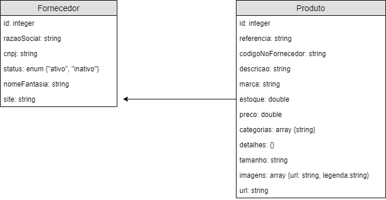
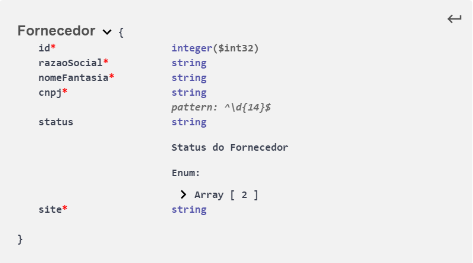
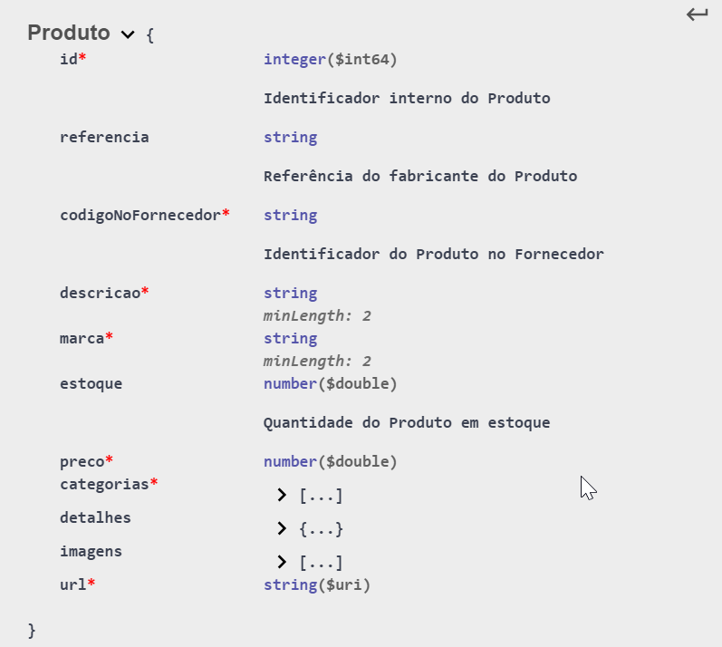
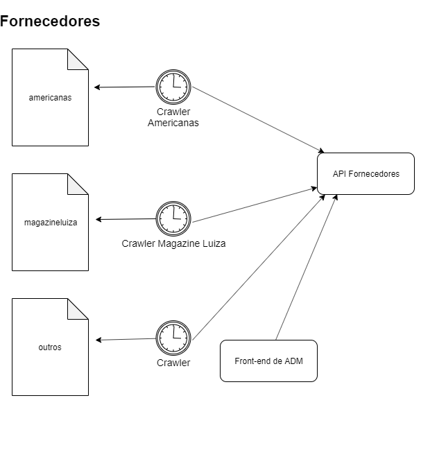

# Modelagem e Cadastramento de Produtos
## Modelagem
A abordagem Contract-First ou API-First Development feita com o Swagger Editor (editor.swagger.io) no padrão OpenApi 3.0.0.

### Modelagem de Dados
Definição dos dados que serão recebidos e retornados pela API:




A partir de um Fornecedor cadastrado, criamos um Produto.

No swagger a modelagem de dados foi feita na seção schemas:

#### Fornecedor
##### Swagger 
``` javascript
  schemas:
    Fornecedor:
      type: object
      properties:
        id:
          type: integer
          format: int32
        razaoSocial:
          type: string
        nomeFantasia:
          type: string
        cnpj:
          type: string
          pattern: '^\d{14}$'
        status:
          type: string
          description: Status do Fornecedor
          enum:
          - ativo
          - inativo
        site:
          type: string
      required:
        - id
        - razaoSocial
        - nomeFantasia
        - cnpj
        - site
```     
##### HTML



#### Produto
##### Swagger 
``` javascript
    Produto:
      type: object
      properties:
        id:
          type: integer
          format: int64
          description: Identificador interno do Produto
        referencia:
          type: string
          description: Referência do fabricante do Produto
        codigoNoFornecedor:
          type: string
          description: 'Identificador do Produto no Fornecedor'
        descricao:
          type: string
          minLength: 2
        marca:
          type: string
          minLength: 2
        estoque:
          type: number
          format: double
          description: Quantidade do Produto em estoque
        preco:
          type: number
          format: double
        categorias:
          type: array
          items:
            type: string
            description: Categorias do Produto
        detalhes:
          type: object
          additionalProperties: {}
          description: 'Características detalhadas do produto: peso, tamanho, polegadas, acessórios, etc. (free-form object)'
        imagens:
          type: array
          items:
            $ref: '#/components/schemas/Imagem'
        url:
          type: string
          format: uri
      required: 
        - id
        - codigoNoFornecedor
        - descricao
        - marca
        - preco
        - categorias
        - url
```     
##### HTML



### URIs: parâmetros e responses
As URIs dos recursos na seção paths:

#### Fornecedor: /fornecedores/{id}
##### Swagger 
``` javascript
paths:
  /fornecedores/{id}:
    get:
      tags:
        - fornecedores
      summary: Retorna um Fornecedor
      parameters:
        - in: path
          name: id
          required: true
          schema:
            type: integer
            format: int32
            minimum: 1
          description: O identificador do fornecedor.
          example: 1
      responses:
        '200':
          description: OK
          content:
            application/json:
              schema:
                $ref: '#/components/schemas/Fornecedor'
        '400':
          $ref: '#/components/responses/Invalido'
        '404':
          $ref: '#/components/responses/NaoEncontrado'
        default:
          $ref: '#/components/responses/Inesperado'
components:
  responses:
    Invalido:
        description: ID especificado inválido (não é um número).
        content:
          application/json:
            schema:
              $ref: '#/components/schemas/ErroResposta'
    NaoEncontrado:
        description: ID especificado não encontrado.   
        content:
          application/json:
            schema:
              $ref: '#/components/schemas/ErroResposta'
    Inesperado:
      description: Erro inesperado.
      content:
        application/json:
          schema:
            $ref: '#/components/schemas/ErroResposta'              
```     

#### Produto: /fornecedores/{fornecedorId}/produtos/{produtoId}
##### Swagger 
``` javascript
  /fornecedores/{fornecedorId}/produtos/{produtoId}:
    get:
      tags:
        - fornecedores/produtos
      summary: Retorna um Produto do Fornecedor
      parameters: 
        - $ref: '#/components/parameters/fornecedor'
        - in: path
          name: produtoId
          required: true
          schema:
            type: integer
            format: int32
            minimum: 1
          description: O identificador interno do produto.
          example: 1      

      responses:
        '200':
          description: OK
          content:
            application/json:
              schema:
                $ref: '#/components/schemas/Produto'
        '400':
          $ref: '#/components/responses/Invalido'
        '404':
          $ref: '#/components/responses/NaoEncontrado'
        default:
          $ref: '#/components/responses/Inesperado'
```     
## Cadastramento de Produtos

A primeira parte do Sistema Drop Shipping envolve a obtenção de produtos nas páginas dos fornecedores cadastrados. 

A API Catálogo foi dividida em 02 APIs menores de forma a separar as responsabilidades: a **API Fornecedores** e a API Produtos

A API Fornecedores tem a responsabilidade de cadastrar os fornecedores e seus produtos.

O cadastro de fornecedores tem caráter de administração do sistema e é feito pelo URI **/fornecedores**.

O cadastro de produtos dos fornecedores pode ser via programas automatizados, crawlers, ou manual, a inserção de produtos sempre passa pela API de Fornecedores, portanto quem vai fazer essa operação tem que implementar o contrato da API Fornecedores, URI: **/fornecedores/1/produtos**.



O objetivo do crawler é, seja fazendo web scrapping da página do fornecedor ou consultando alguma API disponibilizada pelo fornecedor, estruturar os dados dos produtos conforme o contrato repassando-os para API Fornecedores através do método POST (ou PUT) no URI /fornecedores/1/produtos. O final dos dados a serem estruturados fica assim:

``` javascript
{
  "id": 1,
  "referencia": "M280-2V",
  "codigoNoFornecedor": "59874",
  "descricao": "Mouse Logitech M280 sem Fio - Preto",
  "marca": "Logitech",
  "estoque": 10,
  "preco": 200.99,
  "categorias": [
    "informática",
    "periféricos",
    "mouse",
    "mouse óptico",
    "mouse sem fio"
  ],
  "detalhes": {
    "Texto": "Mouse óptico sem fio preto garantia de 30 meses",
    "Cor": "Preto",
    "Código de Barras": "0097855107435",
    "Dimensões": "9x15x6cm"
  },
  "url": "https://www.submarino.com.br/produto/121960403/"
}
``` 

